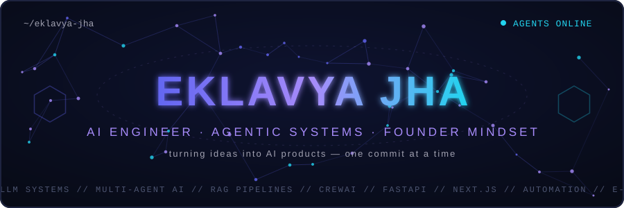
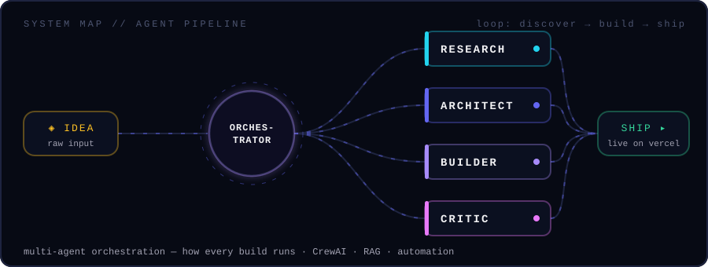

<!-- ============================================================
     EKLAVYA JHA — GitHub Profile README
     Handcrafted animated SVGs in /assets (SMIL — no JS needed)
     This repo doubles as the portfolio site: do NOT delete
     index.html, style.css, script.js or CNAME.
     ============================================================ -->

<div align="center">
  
</div>

<p align="center">
  
</p>

<p align="center">
  <a href="https://github.com/EklavyajhaAI07"></a>
  <a href="https://eklavya.dpdns.org/"></a>
  
</p>


## 🧠 The agent console

<div align="center">
  
</div>

```yaml
Name: Eklavya DilipBhai Jha
Focus: [Agentic & Multi-Agent AI, LLM Systems, RAG Pipelines, AI Automation, Full-Stack + AI Apps]
Currently Learning: core → advanced AI frameworks & LLM training
Open To: startup collaborations, AI product builds, business development ideas
Philosophy: "Learning as engineering — understand deeply, optimize later."
```


## 🕸️ How every build runs

<div align="center">
  
</div>


## 🚀 Featured builds

<table>
<tr>
<td width="50%" valign="top">

<h3 align="center">📄 mdgen-ai</h3>
<p align="center"><em>AI-powered README generator — 50+ users onboarded</em></p>

Transforms text, code, PDFs, images, PPTs or a GitHub URL into a polished, professional README in seconds. Full product build: Google/GitHub OAuth, Razorpay payments, Resend emails, AI crawler blocking, SEO — deployed on Vercel + Railway. <!-- ADD LIVE + REPO LINKS -->

</td>
<td width="50%" valign="top">

<h3 align="center">🎬 Viral AI</h3>
<p align="center"><em>7-agent content intelligence platform · Craftathon 2k26</em></p>

CrewAI orchestration where each agent owns one job — trend discovery across 5 platforms, hooks, captions, hashtags, thumbnails, virality scoring — chained into structured, actionable output instead of raw AI responses. Next.js · FastAPI · MongoDB · Redis. <!-- ADD REPO LINK -->

</td>
</tr>
<tr>
<td width="50%" valign="top">

<h3 align="center">⚖️ CourtFlow AI</h3>
<p align="center">
  <a href="https://github.com/EklavyajhaAI07/CourtFlow-x-PUCODE3.0"></a>
</p>

AI-powered court scheduling that predicts hearing durations from historical case data and auto-allocates judges, courtrooms and slots — replacing manual cause lists. Next.js + TypeScript front, Python ML inference APIs behind. Built at PU CODE Hackathon 3.0.

</td>
<td width="50%" valign="top">

<h3 align="center">📊 FinPB Agent</h3>
<p align="center">
  <a href="https://github.com/EklavyajhaAI07/Analysis-Agent-FinPB"></a>
</p>

FinPlay Bharat's intelligent analysis engine — a fully customizable AI assistant where you bring your own API provider, name the agent, and define the master prompt that shapes its behavior. Flexible conversational AI for financial learning and Q&A.

</td>
</tr>
</table>


## 🏆 Hackathon record

| Event | Result |
|---|---|
| 🟣 **Odoo Hackathon 2026** — TransitOps, Team StackForge | **Grand Finale Finalist** · out of 20,000+ applicants · with [Het Patel](https://github.com/Het161) |
| 🔬 **HackBaroda 2026** — CiteMind, Team Society | **Finalist** · AI citation-memory platform · with [Het Patel](https://github.com/Het161) |
| 🛰️ **ISRO Bharatiya Antariksh Hackathon** — AEGIS | Air-gapped predictive AI copilot (LightGBM · SHAP · Ollama · RAG) · with [Het Patel](https://github.com/Het161) |
| 🚺 **Cognivia (IEEE WIE × PDPU)** | **4th of 153 teams** · proactive AI safety system for women |
| 🤖 **FlowZint AI Hackathon 2026** | **Top 100 Finalist — Silver Tier** · support chatbot track |
| 🏗️ **SEMICON India 2026** — Team DriftLock | Wafer-image localization · with [Het Patel](https://github.com/Het161) |
| 🏖️ **Hacker House Goa 2026 — Open Trials** | Builder ID Card Generator · with [Het Patel](https://github.com/Het161) |
| 🎬 **Craftathon 2k26** | Viral AI — 7-agent CrewAI content platform |
| 🇮🇳 **India AI Impact Buildathon** | Among 40,000+ participants · AI fraud-prevention track |

## 👑 Leadership & community

- 🎓 **Campus Ambassador — E-Cell, IIT Bombay** · active contributor to the National Entrepreneurship Challenge
- 🚀 **Founder's Crew, E-Cell Gandhinagar University** — content writer & Instagram manager, building the campus startup ecosystem
- ✨ **Google Student Ambassador events** — *Top Prompt Creator (Pitch Night)* & *Freshers' Party Champion* with Gemini
- 📈 Hands-on with **GBP optimization, LinkedIn strategy & SEO** — engineering *and* distribution


## 🛠️ Arsenal

### Languages & Core Tools
<p align="center">
  
</p>

### AI / ML / LLM
<p align="center">
  
  
  
  
  
</p>

### Web, Backend & Automation
<p align="center">
  
</p>
<p align="center">
  
  
  
  
  
</p>

## 📚 Learning roadmap

```text
Core AI / ML Foundations   █████████░ 90%
LLM Fundamentals           ████████░░ 80%
RAG & Vector Databases     ███████░░░ 70%
Agentic / Multi-Agent AI   ██████░░░░ 60%
LLM Training & Fine-tuning ████░░░░░░ 40%
Distributed AI Systems     ███░░░░░░░ 30%
```


## 📈 Signal metrics

<div align="center">
  
  
</div>

<div align="center">
  
</div>

<div align="center">
  
</div>

<div align="center">
  
</div>

## 🐍 The snake eats my contributions

<div align="center">
  <picture>
    <source media="(prefers-color-scheme: dark)" srcset="https://raw.githubusercontent.com/EklavyajhaAI07/EklavyajhaAI07/output/github-snake-dark.svg" />
    
  </picture>
</div>


## 🎯 Goals 2026–2028

Production-grade **AI Product Engineer** → scalable **AI startups** → open-source contributions → advanced **LLM fine-tuning** → distributed AI systems → globally useful software.

## 🌐 Connect

<p align="center">
  <a href="mailto:eklavyaprivate22@gmail.com"></a>
  <a href="https://www.linkedin.com/in/eklavya-jha-23a54b377"></a>
  <a href="https://www.instagram.com/eklavyajha_"></a>
  <a href="https://eklavya.dpdns.org/"></a>
</p>

<div align="center">
  
</div>
