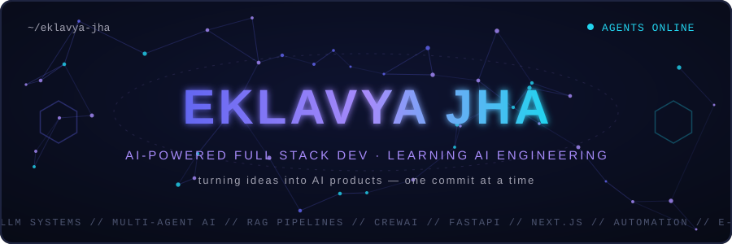
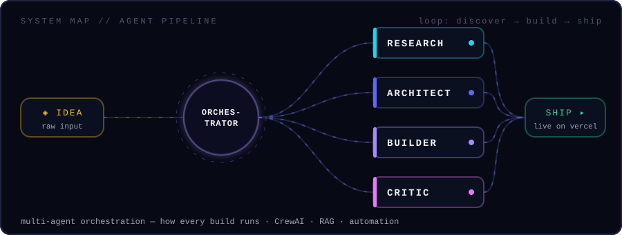

<!-- ============================================================
     EKLAVYA JHA — GitHub Profile README
     Handcrafted animated SVGs in /assets (SMIL — no JS needed)
     Until the new portfolio is live (see deployment.md), this repo
     still serves the old site: do NOT delete index.html, style.css,
     script.js or CNAME. After the cutover they can be removed.
     Keep this repo PUBLIC, or this profile README stops showing.
     ============================================================ -->

<div align="center">
  
</div>

<p align="center">
  
</p>

<p align="center">
  <a href="https://github.com/EklavyajhaAI07"></a>
  <a href="https://eklavya.dpdns.org/"></a>
  
</p>


## 🧠 The agent console

<div align="center">
  
</div>

```yaml
Name: Eklavya Jha
Focus: AI-powered full stack development · learning agentic AI, LLM systems & RAG
Currently Learning: core → advanced AI frameworks & LLM training
Open To: startup collaborations, AI product builds, business development ideas
Philosophy: "Learning as engineering — understand deeply, optimize later."
```


## 🕸️ How every build runs

<div align="center">
  
</div>


## 🚀 Featured builds

<table>
<tr>
<td width="50%" valign="top">

<h3 align="center">🧾 Vasudha: The Manager</h3>
<p align="center">
  <a href="https://vasudha-the-manager.vercel.app/"></a>
</p>

A web app for firms' accounting and management: invoices, bills, payments, financial reports, team access and backups. Client work. My role: full-stack development, plus debugging and security checks. Double-entry bookkeeping and an owner assistant are coming soon.

</td>
<td width="50%" valign="top">

<h3 align="center">🧩 Dealflow360</h3>
<p align="center">
  <a href="https://dealflow360-iota.vercel.app/"></a>
</p>

Internal workspace and customer portal for quotes, approvals, inventory and billing. My Odoo Hackathon 2026 Grand Finale project, built with Team StackForge.

</td>
</tr>
<tr>
<td width="50%" valign="top">

<h3 align="center">🎬 Viral AI</h3>
<p align="center"><em>Multi-agent content platform · in development · Craftathon 2k26</em></p>
<p align="center">
  <a href="https://github.com/EklavyajhaAI07/viral-content-ai"></a>
</p>

An AI-powered content studio that scouts trends, designs strategy, generates content and predicts virality, with each agent owning one job. Next.js · FastAPI · Redis. Currently in development.

</td>
<td width="50%" valign="top">

<h3 align="center">⚖️ CourtFlow AI</h3>
<p align="center">
  <a href="https://github.com/EklavyajhaAI07/CourtFlow-x-PUCODE3.0"></a>
</p>

AI-powered court scheduling that predicts hearing durations from historical case data and auto-allocates judges, courtrooms and slots, replacing manual cause lists. Next.js + TypeScript front, Python ML inference APIs behind. Built at PU CODE Hackathon 3.0 (finalist).

</td>
</tr>
</table>


## 🏆 Hackathon record

| Event | Result |
|---|---|
| 🟣 **Odoo x LDCE Hackathon 2026**: offline finals, ChampoinsClub | **Grand Finale Finalist** · selected from 2000+ applicants · with [Repo](https://github.com/Het161/ChampoinsClub) |
| 🟣 **Odoo x LDCE Hackathon 2026**: virtual round, Globetrotter | Virtual-round project · with [Repo](https://github.com/Het161/globetrotter) , [Live](https://globetrotter-wine-ten.vercel.app) |
| 🟣 **Odoo Hackathon 2026**: offline final, Dealflow360, Team StackForge | **Grand Finale Finalist** · selected from 20,000+ applicants · with [Repo](https://github.com/EklavyajhaAI07/Team-StackForge-Odoo-HQ-Hack) , [Live](https://dealflow360-iota.vercel.app/) |
| 🟣 **Odoo Hackathon 2026**: virtual round, TransitOps | Virtual-round project · with [Repo](https://github.com/Het161/transitops-fleet-management) , [Live]() |
| ⚖️ **PU CODE Hackathon 3.0**: CourtFlow AI | **Finalist** [Repo](https://github.com/EklavyajhaAI07/CourtFlow-x-PUCODE3.0) |
| 🚺 **Cognivia (IEEE WIE × PDPU)** | **Finalist** · **4th of 152 teams** · proactive AI safety system for women |
| 🔬 **HackBaroda 2026**: CiteMind, Team Society | **Finalist** · AI citation-memory platform with [Repo](https://github.com/Het161/CiteMind) , [Live](https://cite-mind-six.vercel.app) |
| 🤖 **FlowZint AI Hackathon 2026** | **Top 100 Finalist, Silver Tier** · support chatbot track |
| 🛰️ **ISRO Bharatiya Antariksh Hackathon**: AEGIS | Participant · air-gapped predictive AI copilot (LightGBM · SHAP · Ollama · RAG) · with [Repo](https://github.com/Het161/AEGIS) , [Live](https://aegis-vert-chi.vercel.app) |
| 🏗️ **SEMICON India 2026**: Team DriftLock | Participant · wafer-image localization · with [Repo](https://github.com/Het161/Team-DriftLock) , [Live](https://taar-psi.vercel.app) |
| 🏖️ **Hacker House Goa 2026, Open Trials** | Participant · Builder ID Card Generator · with [Repo](https://github.com/Het161/HackerHouseGoa) , [Live](https://frameingoa.netlify.app) |
| 🎬 **Craftathon 2k26** | Participant · Viral AI |
| 🇮🇳 **India AI Impact Buildathon** | Participant · among 40,000+ participants · AI fraud-prevention track |

## 👑 Leadership & community

- 🎓 **Campus Ambassador, E-Cell IIT Bombay** (remote)
- 🧭 **SIH Student Coordinator 2026**
- 🚀 **Founder's Crew, E-Cell Gandhinagar University**: content writer & Instagram manager, building the campus startup ecosystem
- ✨ **Google Student Ambassador**: *Top Prompt Creator* award; participant in the *Fresher's Party Night Edition* (Gemini tasks)
- 📈 Hands-on with **GBP optimization, LinkedIn strategy & SEO**: engineering *and* distribution


## 🛠️ Arsenal

### Languages & Core Tools
<p align="center">
  
</p>

### AI / ML / LLM
<p align="center">
  
  
  
  
  
</p>

### Web, Backend & Automation
<p align="center">
  
</p>
<p align="center">
  
  
  
  
  
</p>

## 📚 Currently learning

- Core AI / ML foundations · LLM fundamentals · RAG & vector databases
- Agentic / multi-agent AI · LLM training & fine-tuning · distributed AI systems


## 📈 Signal metrics

<div align="center">
  
  
</div>

<div align="center">
  
</div>

<div align="center">
  
</div>

<div align="center">
  
</div>

## 🐍 The snake eats my contributions

<div align="center">
  <picture>
    <source media="(prefers-color-scheme: dark)" srcset="https://raw.githubusercontent.com/EklavyajhaAI07/EklavyajhaAI07/output/github-snake-dark.svg" />
    
  </picture>
</div>


## 🎯 Goals 2026–2028

Production-grade **AI Product Engineer** → scalable **AI startups** → open-source contributions → advanced **LLM fine-tuning** → distributed AI systems → globally useful software.

## 🌐 Connect

<p align="center">
  <a href="https://eklavya.dpdns.org/"></a>
  <a href="https://www.linkedin.com/in/eklavya-jha-23a54b377"></a>
  <a href="https://x.com/EklavyajhaAI07"></a>
</p>

<p align="center"><em>For projects or hiring, use the contact form on the portfolio.</em></p>

<div align="center">
  
</div>